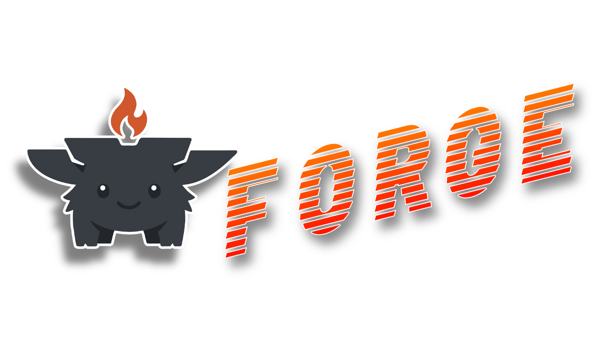

<p align="center">
  
</p>

<p align="center">
  <a href="https://github.com/celestiamia/Forge/actions/workflows/ci.yml">
    
  </a>
  <a href="LICENSE">
    
  </a>
  <a href="https://github.com/celestiamia/Forge/issues">
    
  </a>
</p>

---

# Forge

Forge is a systems programming language compiled by `forgec` from `.dev` source files.

`forgec` is **self-contained**: it parses `.dev` source and writes native
executables directly, without calling LLVM, clang, NASM, ld, or any other
external toolchain. One binary, straight to machine code.

> **Mascot** — Say hello to Spark! The forge's flame — small but intense, turning raw code into native metal. You'll find Spark throughout the docs and examples, reminding you that Forge compiles *directly* to machine code, no intermediate layers.

## Features

- **Native codegen, no toolchain** — emits machine code and object format (ELF64, ELF32, or flat binary) directly from Rust
- **Three targets** — x86_64 and x86_32 Linux executables, plus a flat 512-byte x86 real-mode boot sector
- **Python-like syntax** — indentation-based: `def`, `let`/`var`, `if`/`elif`/`else`, `for`/`while`/`loop`, `match`/`case`, `struct`, `as` casts
- **Low-level control** — raw pointers, `unsafe` blocks, `extern` declarations, width-correct volatile access
- **Module system** — `std.*` imports resolve to `core/<name>.dev` (or the stdlib embedded in the binary when no `core/` is present); user modules resolve to local `.dev` files
- **Memory management** — first-fit heap allocator with optional conservative mark-and-sweep GC (x86_64)
- **Bare metal** — the bootloader example is written entirely in Forge, no inline assembly required

## Quickstart

```bash
cargo build --release
./target/release/forgec examples/hello.dev -o hello --target x86_64-unknown-linux-gnu
./hello
# Hello, Forge!
```

Prebuilt binaries are published as [nightly releases](https://github.com/celestiamia/Forge/releases?q=nightly&expanded=true).

The compiled `forgec` binary is fully self-contained — the standard library is
embedded, so no `core/` checkout is needed. Arch Linux users can install it
from the AUR as [`forgec-git`](https://aur.archlinux.org/packages/forgec-git)
(`paru -S forgec-git`).

## Documentation

The full documentation lives in the [mdbook](docs/README.md) and is deployed to
GitHub Pages:

- [Installation](docs/getting-started/installation.md)
- [Language Reference](docs/language/README.md)
- [Standard Library](docs/stdlib/README.md)
- [Supported Targets](docs/targets/README.md)
- [Known Issues & Limitations](docs/language/known-issues.md)

## Project layout

- `examples/` — sample Forge programs, including a hosted hello world, stdlib exercises, and a bare-metal bootloader
- `core/` — standard library modules imported as `std.*` (e.g. `core/io.dev` is `std.io`)
- `src/lexer/`, `src/parser/`, `src/ast/` — Python-like frontend
- `src/sema/`, `src/lower/` — type checking and AST → IR lowering
- `src/backend/` — x86-64, x86-32, and 16-bit assemblers and code generators
- `src/obj/` — ELF64/ELF32 executable and flat binary writers
- `tests/` — Rust-based unit and integration tests

## Standard library

| Module | Highlights |
|--------|------------|
| `std.io` | `puts`, `putchar`, `getchar`, `rand`, `exit`, plus syscalls (`open`, `read`, `write`, `socket`, `fork`, `waitpid`, …) |
| `std.runtime` | `abort`, `exit` |
| `std.mem` | `copy_bytes`, `set_bytes`, `zero_bytes`, `compare_bytes` |
| `std.string` | `strlen`, `strcmp`, `strncmp`, `strstr`, `strchr`, `strcat`, `strncpy` |
| `std.math` | `abs_i32`, `min_i32`, `max_i32`, `clamp_i32` |
| `std.fmt` | `format_i32`, `format_f64` |
| `std.volatile` | width-correct loads/stores and memory barriers |
| `std.alloc` | `alloc`/`free` over a first-fit heap; auto-GC on exhaustion (x86_64) |
| `std.gc` | `collect`, `leak_check`, heap stats (x86_64 only) |

## Supported targets

| Target triple              | Description                       | Status    |
|----------------------------|-----------------------------------|-----------|
| `x86_64-unknown-linux-gnu` | 64-bit Linux (ELF64)              | Supported |
| `x86_32-unknown-linux-gnu` | 32-bit Linux (ELF32, i686)        | Supported |
| `x86_16-boot`              | 16-bit x86 real-mode boot sector  | Supported |
| `x86_64-apple-darwin`      | 64-bit macOS (Mach-O)             | Planned   |
| `x86_64-pc-windows-gnu`    | 64-bit Windows (COFF)             | Planned   |
| `riscv64-unknown-elf`      | 64-bit RISC-V bare metal (ELF)    | Planned   |

## Roadmap & Ideas

Forge's roadmap lives in [`ROADMAP.md`](./ROADMAP.md), a living document of
features and improvements organized by theme. These ideas are preliminary and
**may fluctuate and change over time** as Forge matures — they are a starting
point for discussion, not a fixed contract. Feedback, corrections, and new
proposals are welcome.

To propose a new item, open a pull request amending `ROADMAP.md` (or GitHub
issues for broader discussion).

🔗 **[GitHub Issues](https://github.com/celestiamia/Forge/issues)**

## Contributing

See [CONTRIBUTING.md](CONTRIBUTING.md) for guidelines on:
- Development workflow
- Code style and testing requirements
- Pull request process
- Commit message format

## License

Forge is licensed under the **MIT License** — see [LICENSE](LICENSE) for details.